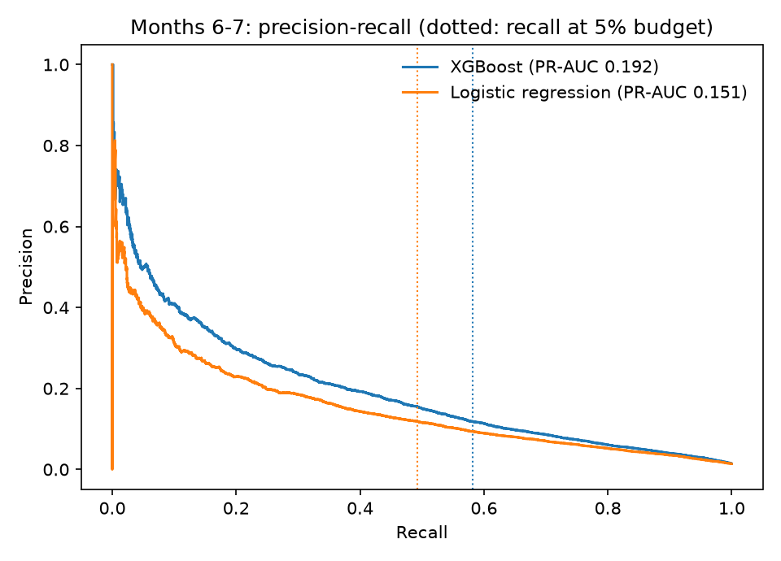

# Bank account opening fraud: cost-based decisions, fairness audit and drift

[](https://github.com/Rodgrandez/bank-account-fraud-detection/actions/workflows/ci.yml)

A fraud model is only useful if a fraud team can operate it: a fixed review budget, calibrated probabilities for
cost-based decisions, equal treatment across customer groups and a plan for when the data drifts. This project
builds and validates such a model on the public Feedzai Bank Account Fraud dataset with a strictly time-based
design: tuned on months 0-4, calibrated and thresholded on month 5, and evaluated once on the unseen months 6-7.



<!-- RESULTS:START -->
<!-- RESULTS:END -->

## Data
Feedzai Bank Account Fraud (BAF) suite, Base variant: about one million synthetic bank account applications over
eight months, generated from a real fraud dataset with CTGAN and differential-privacy noise (Jesus et al., 2022,
"Turning the Tables: Biased, Imbalanced, Dynamic Tabular Datasets for ML Evaluation", NeurIPS). License
CC BY-NC-SA 4.0; the data are downloaded by `make data` and not redistributed here.

## Design (declared before looking at months 6-7)
- **Validation:** hyperparameters and early stopping by rolling origin inside months 0-4; month 5 split into a
  calibration half and a decision half; months 6-7 used once. No resampling (it distorts probabilities).
- **Decisions:** (i) review budget: threshold giving 5% false positives on month 5, applied unchanged to the future;
  (ii) cost rule: alert when calibrated probability >= 1/R, where R is the ratio of the loss from a missed fraud to
  the cost of one review (BAF has no amounts, so R in {20, 50, 100} is an explicit assumption).
- **Fairness:** age is not a model input; the audit compares false-positive rates for applicants aged 50+ and
  under 50, and measures the cost of equalising them with group thresholds. Group thresholds treat applicants
  differently by age and may be legally problematic, so they are presented as a trade-off, not a recommendation.
- **Uncertainty:** 1,000 bootstrap replicates on months 6-7; XGBoost is called better than the logistic benchmark
  only if the interval for the recall difference excludes zero.

See [the model card](reports/model_card.md) for limitations and monitoring rules.

## Reproduce
```bash
conda env create -f environment.yml && conda activate fraud-detection
make all      # needs a Kaggle API token; downloads the data, tunes, evaluates and writes reports/
```

License: MIT (code). Data: CC BY-NC-SA 4.0 (Feedzai).
